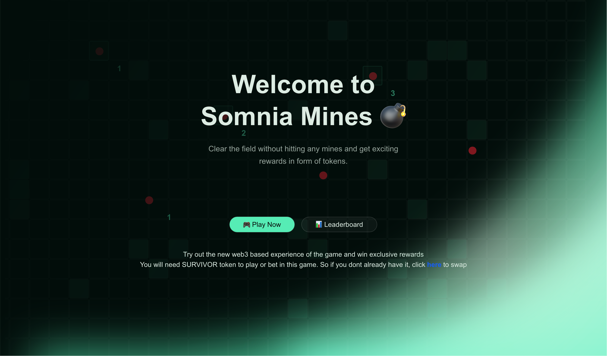
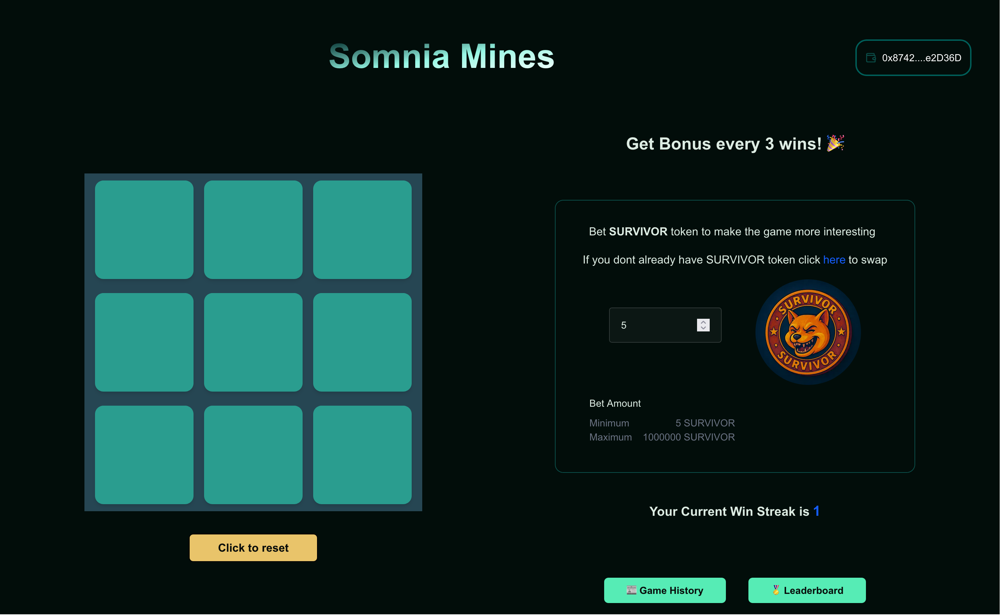
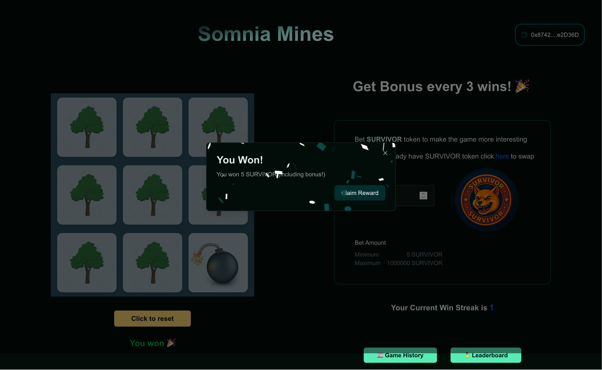
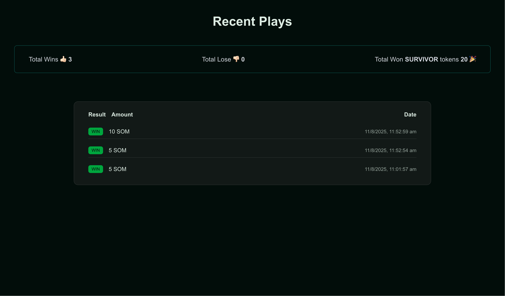
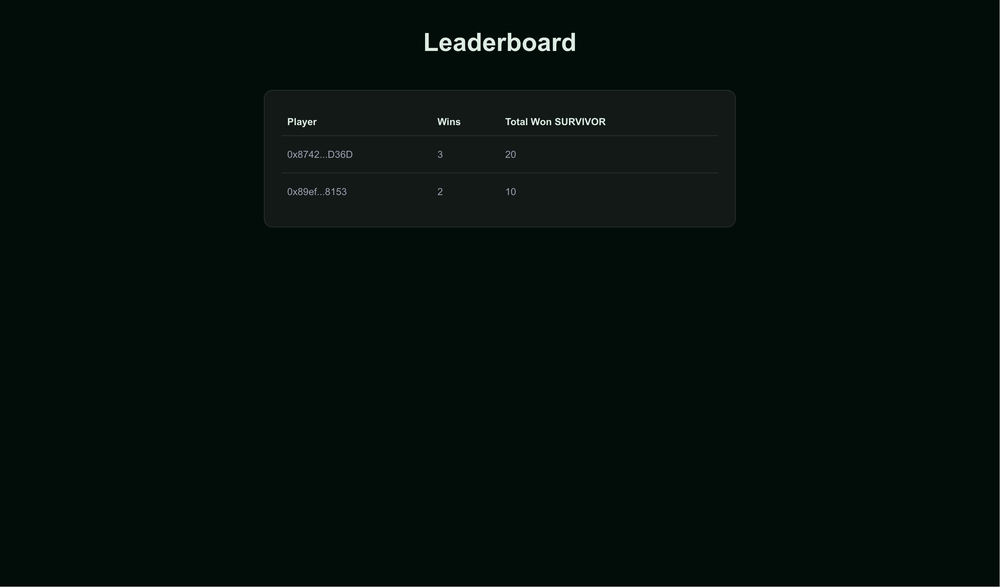

# Somnia Mines 💣🏆

Web3-powered Mines game on Somnia Testnet. Connect your wallet, place a bet in SURVIVOR tokens, avoid the mine, and claim on-chain rewards. Win streaks earn periodic bonuses.

Live demo: coming soon

Screenshots/GIF: add your screenshots from the running app (Landing, Game, Leaderboard, History)






---

## Highlights

- Provably on-chain payouts: rewards are transferred via an API that signs ERC-20 transfers server-side using `ethers` and an admin wallet
- Wallet-first UX: one-click connect and automatic Somnia Testnet network add
- Streak bonuses: every 3rd win gets a 2x multiplier by default
- Leaderboard and history: instant local experience powered by localStorage
- Modern UI: Next.js App Router, React 19, Tailwind (Shadcn UI), framer-motion

---

## Tech Stack

- Next.js 15 (App Router) + React 19
- TypeScript
- Tailwind CSS + Shadcn UI (Radix)
- Ethers v6
- Sonner (toasts), framer-motion, lucide-react

---

## How It Works

1. Player connects a wallet. The dApp attempts to add Somnia Testnet automatically using parameters in `src/lib/somnia.ts`.
2. The player selects a bet amount (SURVIVOR tokens) and plays a 3x3 Mines round.
3. On win:
   - Local streak increments. If the streak hits the configured threshold (`BONUS_THRESHOLD`, default 3), a 2x bonus (`BONUS_MULTIPLIER`) is applied.
   - The client calls the secure API `POST /api/send-tokens` to transfer SURVIVOR tokens from the admin wallet to the player.
   - Leaderboard and history are updated locally.
4. On loss:
   - Streak resets.
   - The client performs a user-signed ERC-20 transfer of SURVIVOR to the owner address ("Pay Owner").
   - History is recorded locally.

The Leaderboard and Game History are stored in the browser’s `localStorage` and update in real time.

---

## Project Structure

```
app/                    # Next.js app router pages
  api/send-tokens/      # Server route to transfer SURVIVOR rewards
  game/                 # Game page
  history/              # Activity feed
  leaderboard/          # Local leaderboard
src/components/         # UI and feature components (game, modal, etc.)
src/lib/                # Chain config, ERC-20, wallet helpers, history/leaderboard/streak logic
public/                 # Static assets
```

Key files:

- `src/lib/somnia.ts`: Somnia Testnet RPC and chain metadata; owner address placeholder
- `app/api/send-tokens/route.ts`: Server-side token transfer via admin key
- `src/lib/token.ts`: Client functions to send tokens
  - `sendSurvivorToken` (admin → user payout via API)
  - `payOwnerOnLoss` (user → owner transfer signed by the user)
- `src/components/mines-game.tsx`: Game grid logic (3x3)
- `src/components/game-result-modal.tsx`: Win/Loss modal and reward claim
- `src/lib/streak.ts`: Bonus rules (`BONUS_THRESHOLD`, `BONUS_MULTIPLIER`)
 - `src/lib/somnia.ts`: Contains `OWNER_ADDRESS` (loss recipient). Update this to your owner wallet.

---

## Prerequisites

- Node.js 18+ and npm
- A web3 wallet (e.g., MetaMask) installed
- A deployed ERC-20 token on Somnia Testnet with sufficient balance in the admin wallet (used to pay rewards). The code assumes the token symbol is “SURVIVOR”, but any ERC-20 will work with the correct env vars.

---

## Environment Variables

Copy `.env.example` to `.env.local` and fill in values:

```
NEXT_PUBLIC_SURVIVOR_TOKEN_ADDRESS="0xYourTokenAddressOnSomniaTestnet"
NEXT_PUBLIC_SURVIVOR_DECIMALS="18"
ADMIN_PRIVATE_KEY="0xYourAdminWalletPrivateKeyWithRewardsBalance"
```

Notes:

- `ADMIN_PRIVATE_KEY` belongs to the wallet that holds reward tokens. It is used ONLY server-side by the Next.js API route to sign transfers. Do not expose it anywhere on the client.
- Ensure the admin wallet has sufficient SURVIVOR token balance and enough native STT for gas on Somnia Testnet.
 - Loss payments use the user’s signer and will consume the user’s gas. The recipient is `OWNER_ADDRESS` in `src/lib/somnia.ts`.

---

## Somnia Testnet Configuration

The app attempts to add Somnia Testnet automatically on connect using the parameters in `src/lib/somnia.ts`:

```
chainId: 0xc488
chainName: Somnia Testnet
rpcUrls: ["https://dream-rpc.somnia.network"]
blockExplorerUrls: ["https://somnia-testnet.socialscan.io"]
nativeCurrency: { name: "Somnia", symbol: "STT", decimals: 18 }
```

If your RPC or chain details differ, update `src/lib/somnia.ts` accordingly.

---

## Getting Started

Install dependencies and run the dev server:

```bash
npm install
npm run dev
```

Open http://localhost:3000

---

## Gameplay & Rewards

- Grid: 3x3 (one hidden mine). Click a tile to reveal.
- Bet: set the amount of SURVIVOR to stake (displayed in the UI). Min/max configurable in `bet-selector.tsx` via props.
- Win: If you avoid the mine, you can “Claim Reward” and the app triggers an ERC-20 transfer from the admin wallet to your address (server-signed).
- Streak Bonus: Every `BONUS_THRESHOLD` wins (default 3), rewards are multiplied by `BONUS_MULTIPLIER` (default 2x).
- History & Leaderboard: Maintained locally in `localStorage` for instant UX.
- Loss: Clicking “Pay Owner” sends a user-signed ERC-20 transfer of your bet amount (scaled by `NEXT_PUBLIC_SURVIVOR_DECIMALS`) to `OWNER_ADDRESS`.

---

## API

### POST /api/send-tokens

Transfers SURVIVOR tokens from the admin wallet to a recipient on Somnia Testnet.

Request body:

```json
{
  "to": "0xRecipientAddress",
  "amount": "<token_units_string>"
}
```

Response:

```json
{
  "success": true,
  "transactionHash": "0x...",
  "amount": "...",
  "recipient": "0x..."
}
```

Notes:

- The server validates `to`, checks admin balance, signs, and broadcasts the transfer using `ethers` with the Somnia RPC from `SOMNIA_TESTNET_PARAMS`.
- Ensure `.env.local` is configured and the admin wallet is funded with both SURVIVOR and STT for gas.
- Loss payments are not handled by this API; they are direct user → owner transfers on the client.

---

## Security Considerations

- The admin private key is loaded on the server only via environment variables; it must never be committed.
- For production, prefer a hosted key management solution or a custodial service with role-based access control and rate limits.
- Add additional server-side validation/rate limiting (IP throttling, CAPTCHA, auth) to protect reward drains in public deployments.

---

## Testing the Flow

1. Connect wallet from the landing page.
2. If prompted, approve adding the Somnia Testnet network.
3. Ensure your visible account is a valid address on Somnia Testnet.
4. Set a bet amount and play a few rounds.
5. On a win, click “Claim Reward” and verify the admin → user transfer on the Somnia explorer with the returned tx hash.
6. On a loss, click “Pay Owner” and verify the user → owner transfer from your wallet.
7. Check the History and Leaderboard pages.

---

## Deployment

### Vercel

1. Push the repo to GitHub.
2. Import into Vercel and set the Environment Variables (`NEXT_PUBLIC_SURVIVOR_TOKEN_ADDRESS`, `NEXT_PUBLIC_SURVIVOR_DECIMALS`, `ADMIN_PRIVATE_KEY`).
3. Deploy. The API route will run server-side on Vercel’s Edge/Node runtime.

### Self-hosting

1. Build: `npm run build`
2. Start: `npm start` (ensure `.env` is configured)

---

## Known Limitations / Future Work

- Local-only leaderboard/history: replace with a backend database or on-chain storage for global visibility.
- RNG fairness: move the mine placement or reward logic to a verifiable source (e.g., VRF) for provable fairness.
- Reward claims: replace direct server-signed transfers with signed claims or allowlist vouchers to reduce key exposure.
- Comprehensive rate limiting and abuse prevention in the API.
- Multi-token and multi-chain support.

---

## Development Scripts

```json
{
  "dev": "next dev --turbopack",
  "build": "next build",
  "start": "next start",
  "lint": "next lint"
}
```

---

## Acknowledgements

- Somnia Network (testnet RPC and explorer)
- Next.js, React, Tailwind CSS, Shadcn UI, Radix
- Ethers.js

